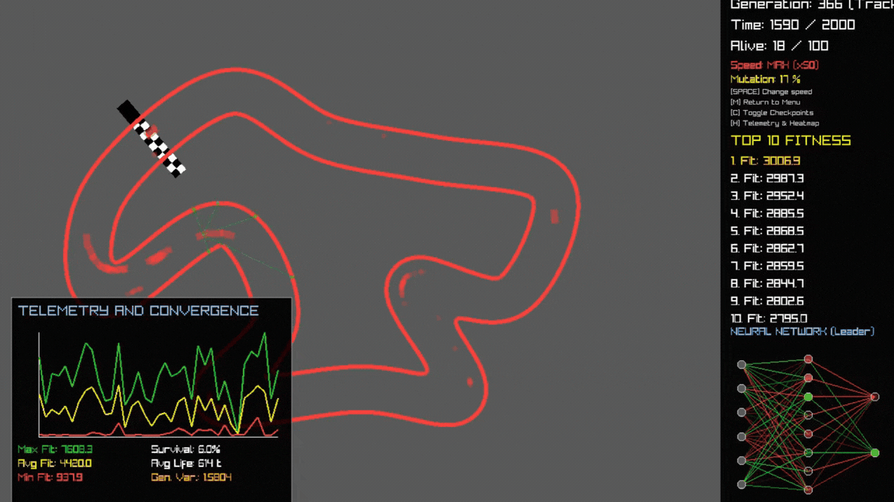
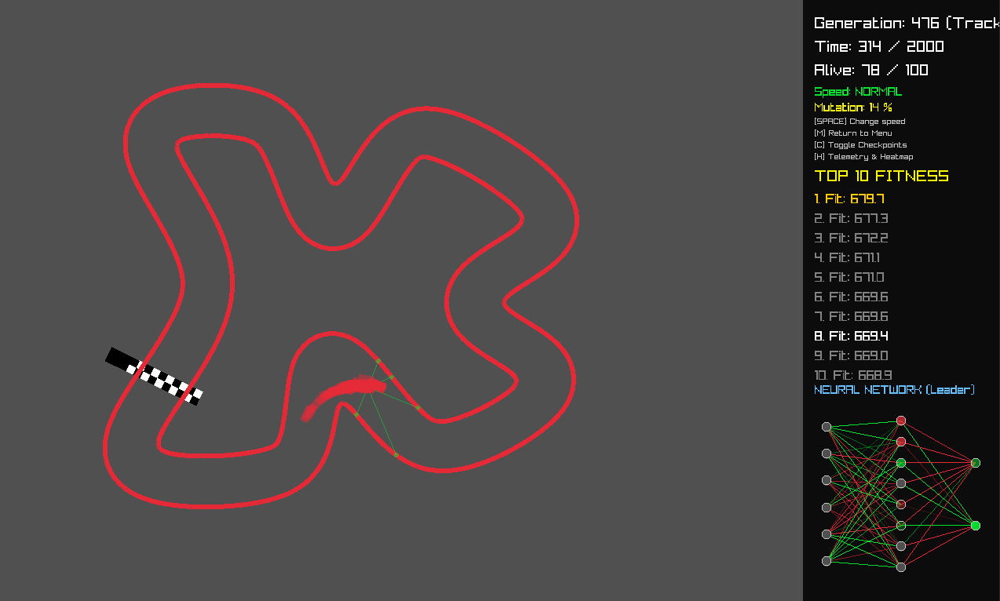
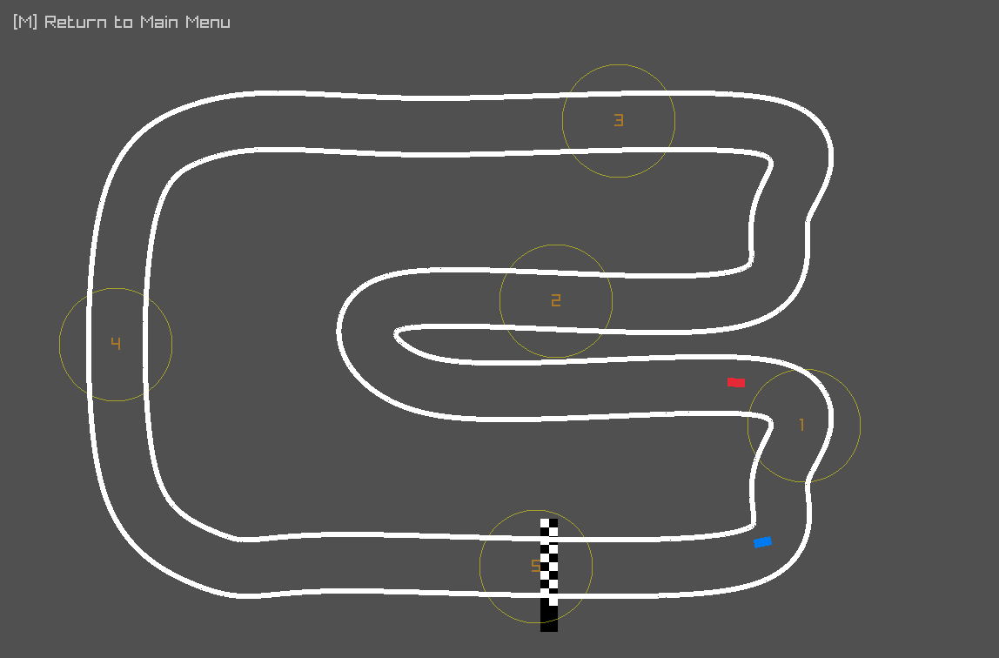
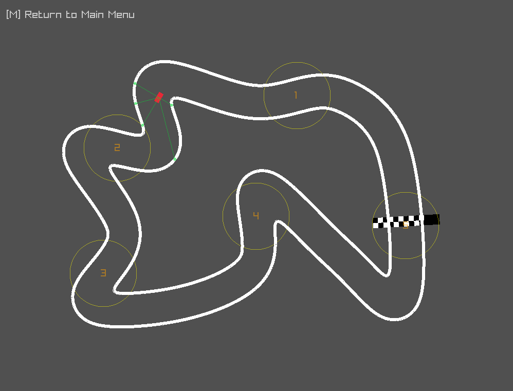

# NeuralRacer-CPP

A High-Performance 2D Autonomous Driving Simulation and Neuroevolution Engine in Modern C++17.

[](https://en.cppreference.com/w/cpp/17)
[](https://www.raylib.com/)
[](https://cmake.org/)
[](https://oneapi-src.github.io/oneTBB/)
[](LICENSE)

---

## Autonomous Training in Action



*Autonomous agents learning to navigate procedural racetracks using raw proximity raycasts and velocity vectors. The telemetry dashboard on the bottom left monitors fitness curves, while the neural topology map on the bottom right visualizes active synaptic weights in real time.*

---

## Technical Highlights

NeuralRacer-CPP is a high-performance simulation engine designed to explore autonomous driving behaviors through neuroevolutionary algorithms. The core objective of the project is to simulate realistic physical vehicle dynamics and train autonomous agents to navigate complex, procedurally generated race tracks. 

To achieve maximum computational efficiency and real-time responsiveness, the entire system is built **completely from scratch** in Modern C++17 without relying on high-level machine learning frameworks or pre-existing physics engines.

*   **Spatial Partitioning:** Utilizes a custom **Spatial Hashing Grid** to reduce narrow-phase collision checks and sensor raycasting from $O(N)$ to $O(1)$, enabling hundreds of frames per second.
*   **Hardware Concurrency:** Exploits multi-core architectures by parallelizing the physics engine and neural network evaluations using C++17 `std::execution::par_unseq` backed by **Intel OneTBB**.
*   **Asynchronous Subsystems:** Implements non-blocking disk serialization (`std::async`/`std::future`) to isolate high-frequency hot paths from storage delays during generational checkpoints.
*   **Custom Neural Control:** Employs a custom Feedforward Neural Network (FNN) and a Genetic Algorithm featuring dynamic Gaussian mutation decay and elitism, all written from first principles.

---

## Operational Simulation Modes

The engine provides three distinct simulation configurations to analyze agent behaviors and allow interactive testing:

| **1. Training Mode** | **2. Exhibition Mode** | **3. Test AI Mode** |
| :---: | :---: | :---: |
|  |  |  |
| *Neural network undergoing continuous training with live dashboard metrics and weight visualizations.* | *Manual player driving (blue car) competing head-to-head against the elite neural network brain (red car).* | *Observing the standalone driving strategy of the saved elite network navigate challenging curves.* |

---

## System Architecture

The following diagram illustrates the execution lifecycle, data pipelines, and concurrency models utilized by the simulator:

```mermaid
flowchart TD
    subgraph Initialization
        A[Procedural Generation / Track Loader] --> B[Generate Spatial Hashing Grid]
        B --> C[Initialize Population: 100 Agents]
    end

    subgraph Parallel Physics & Inference Loop [Multi-threaded via Intel TBB]
        C --> D[Compute Sensor Raycasts]
        D --> E[Evaluate Neural Network - 6-8-2]
        E --> F[Apply Vehicle Dynamics - Drift & Inertia]
        F --> G{Collision or Timeout Detected?}
        G -- Yes --> H[Register Crash & Update Telemetry]
        G -- No --> I[Accumulate Fitness & Cross Checkpoints]
    end

    subgraph Evolutionary Pipeline [End of Generation Cycle]
        H & I --> J[Sort Population by Fitness]
        J --> K[Elitism: Preserve Top 10% Intact]
        J --> L[Two-Parent Crossover & Decaying Gaussian Mutation]
        K & L --> M[Reset Agents to Starting Grid]
        M --> C
    end

    subgraph Asynchronous Subsystems
        F --> N[Render Live Weight Visualization & Activation Dashboard]
        H --> O[Update Spatial Collision Heatmap]
        J --> P[Non-blocking CSV Data Export - std::future]
    end

    style Parallel Physics & Inference Loop fill:#252525,stroke:#444,stroke-width:2px,color:#fff
    style Evolutionary Pipeline fill:#1a2b3c,stroke:#444,stroke-width:2px,color:#fff
```

---

## Core Technical Features & Code Highlights

### 1. High-Concurrency Physics and Inference Loop
To simulate 100 agents concurrently under tight real-time constraints, the engine leverages C++17 vectorization and multi-core processing. Inferences and kinematics are updated in parallel using a thread-safe implementation.

```cpp
// From src/Simulation.cpp
// Fully parallelized evaluation of the active population using STL Execution Policies
std::for_each(std::execution::par_unseq, population.begin(), population.end(), [&](Car& car) {
    if (!car.isCrashed) {
        float inputAccelerate = 0.0f, inputTurn = 0.0f;
        
        // 1. Evaluate the custom neural network
        car.brain.Evaluate(car.sensorDistances, car.GetSpeed(), inputAccelerate, inputTurn);
        
        // 2. Perform narrow-phase physics and collision routines
        car.UpdatePhysics(inputAccelerate, inputTurn, spatialGrid, generationTimer, trackCheckpoints);
        
        if (car.isCrashed) {
            Telemetry::RecordCrash(car.position);
        }
    }
});
```

### 2. Spatial Grid Partitioning (Collision Optimization)
Instead of executing naive $O(N)$ collision tests against all boundary segments, the track is divided into a static $100\times100\text{px}$ spatial hashing grid. This limits collision tests and sensor raycasts to immediately adjacent walls, resulting in a true $O(1)$ narrow-phase query.

```cpp
// From src/Car.cpp
// O(1) Localized Wall Lookup using a Spatial Hashing Grid
int myCellX = position.x / TrackManager::GRID_CELL_SIZE;
int myCellY = position.y / TrackManager::GRID_CELL_SIZE;

// Retrieve segments from a localized 5x5 cell viewport around the vehicle
for (int gridX = myCellX - 2; gridX <= myCellX + 2; gridX++) {
    for (int gridY = myCellY - 2; gridY <= myCellY + 2; gridY++) {
        uint64_t key = TrackManager::GetGridKey(gridX, gridY);
        if (spatialGrid.find(key) != spatialGrid.end()) {
            for (auto wallLine : spatialGrid.at(key)) {
                // Narrow-phase OBB vehicle segment intersection
                if (CheckSegmentIntersection(carCorners, wallLine)) {
                    isCrashed = true;
                }
            }
        }
    }
}
```

### 3. Custom Neural Network & Dynamic Neuroevolution
The behavioral engine models decision-making processes from first principles:
*   **6-8-2 FNN Topology:** Integrates 5 directional proximity inputs and speed, processed through a hidden layer with hyperbolic tangent ($\tanh$) activation to yield symmetrical control metrics.
*   **Hyperbolic Mutation Decay:** Implements an adaptive genetic algorithm. As generations advance, the mutation probability decays dynamically, transitioning smoothly from high-frequency exploration to high-precision exploitation:
    $$\text{Mutation Rate} = \frac{\text{Max Mutation}}{1.0 + (\text{Drop Rate} \times \text{Generation})}$$
*   **Two-Parent Crossover & Elitism:** Keeps the top 10% elite brains completely intact across generations. The rest of the population is bred using a random genetic weight blend of two parents chosen exclusively from the elite group.

### 4. Mathematical Track Generation Pipeline
Includes a complete procedural generation framework to ensure agent robustness and avoid track-specific overfitting:
*   **Exclusion-Zone Node Distribution:** Distributes random control points maintaining strict Euclidean minimum distances.
*   **TSP Optimization (2-Opt):** Orders nodes utilizing a **Nearest Neighbor** traveling salesperson solver, then applies the **2-Opt** algorithm to eliminate intersecting lines.
*   **Spline Interpolation:** Applies **Catmull-Rom** splines to convert discrete routes into continuous curves.
*   **Winding-Order Validation:** Computes the signed **Gauss Area** of the track to guarantee a uniform counter-clockwise winding layout, preventing boundary collapse when generating inner and outer track walls.

### 5. Advanced Kinematics & Race Physics
The vehicle kinematics engine bypasses simplified movement models in favor of real-world race physics:
*   **Tire Slip and Lateral Drift:** Simulates lateral slip angle and cornering stiffness coefficients ($C_{\alpha}$). Exceeding traction thresholds induces realistic rotational slipping.
*   **Dynamic Weight Transfer:** Acceleration shifts normal forces rearward, reducing steering capacity (understeer); braking transfers load forward, sharpening steering response.
*   **Aerodynamics:** Applies quadratic drag force and speed-scaled downforce to stabilize tire cornering capabilities.

---

## System Performance & Design Patterns

The engineering challenges resolved in the codebase are mapped below to show the specific design patterns and systems paradigms utilized:

| Engineering Challenge | Architectural Solution | System Outcome |
| :--- | :--- | :--- |
| **Low Latency Updates** | Minimizing heap allocations on runtime hot paths, adopting cache-friendly static structures, and strict RAII usage. | Eliminates garbage collection spikes, ensuring consistent frame pacing under heavy computational loads. |
| **Parallel CPU Execution** | Vectorized loop parallelism via parallel STL algorithms and dynamic work stealing. | Maximizes multi-core occupancy, scaling updates seamlessly across available CPU cores. |
| **Geometric Complexity** | Procedural Catmull-Rom splines, TSP heuristics, oriented bounding boxes (OBB), and localized vector intersections. | Delivers robust spatial generation and pixel-perfect collision checks. |
| **Storage Bottlenecks** | Isolating persistent disk writing operations (JSON and CSV) to asynchronous `std::async` worker threads. | Prevents main-thread rendering hiccups when saving elite brains or generational logs. |

---

## Tech Stack & Dependencies

*   **Language Standard:** Modern C++ (C++17)
*   **Graphics & Input Polling:** [raylib](https://www.raylib.com/) (Used strictly for windowing, hardware-accelerated 2D rendering, and keyboard input polling)
*   **Task Concurrency:** [Intel OneTBB (Threading Building Blocks)](https://oneapi-src.github.io/oneTBB/)
*   **Build Automation:** CMake 3.10+
*   **Data Serialization:** [nlohmann/json](https://github.com/nlohmann/json) (Header-only serialization for agents and tracks)

---

## Directory Structure

```
NeuralRacer-CPP/
├── CMakeLists.txt         # CMake build configuration
├── LICENSE                # MIT License
├── README.md              # Project documentation
├── ROADMAP.md             # Development status tracker
├── docs/                  # Media and instructional documentation
│   ├── INSTRUCTIONS.md    # Guide on capturing images/GIFs for the simulator
│   ├── Training.gif       # Principal animated training loop capture
│   ├── Training.png       # Training mode screenshot
│   ├── Exhibition.png     # Exhibition mode screenshot
│   └── TestAI.png         # Test AI mode screenshot
├── include/               # Header definitions
│   ├── Brain.h            # Neural network struct and inference functions
│   ├── Car.h              # Vehicle state, kinematics, and OBB structure
│   ├── Config.h           # Simulation parameters, physical constants, and GA variables
│   ├── Evolution.h        # Genetic operators, crossover, and serialization helpers
│   ├── Simulation.h       # Main program coordinator and screen state machine
│   ├── Telemetry.h        # Metrics collector, live dashboard, and CSV logger
│   ├── TrackGenerator.h   # Procedural logic (TSP, 2-Opt, splines)
│   ├── TrackManager.h     # Grid Hashing utilities and track I/O routines
│   └── json.hpp           # nlohmann JSON utility library
├── src/                   # Source implementations
│   ├── Car.cpp            # Vehicle physics, weight transfer, and OBB checks
│   ├── Evolution.cpp      # Genetic algorithm execution and genome loading
│   ├── Simulation.cpp     # Execution loops, window drawing, and input handling
│   ├── Telemetry.cpp      # GUI dashboard rendering and async file writers
│   ├── TrackManager.cpp   # Catmull-Rom math, grid insertion, and raycasts
│   └── main.cpp           # Program entry point and CLI parser
├── data/                  # Persistent data directory
│   ├── best.json          # Serialized genomes of elite agents
│   ├── telemetry_log.csv  # Generational fitness logs
│   └── tracks/            # JSON track files
└── lib/                   # Project dependencies (optional)
```

---

## Installation & Build Instructions

### Prerequisites

Ensure a C++17 compatible compiler (GCC 8+, Clang 7+, or MSVC 2019+) is installed alongside CMake, raylib development libraries, and Intel TBB headers.

#### Ubuntu / Debian Installation:
```bash
sudo apt update
sudo apt install build-essential cmake libraylib-dev libtbb-dev
```

### Compilation

```bash
# 1. Clone the repository
git clone https://github.com/jorgebd21/ML_Coches.git
cd ML_Coches

# 2. Setup build directory
mkdir build && cd build

# 3. Configure build environment
cmake ..

# 4. Compile binary target
cmake --build .

# 5. Run the application
./bin/app
```

---

## Execution Modes & Control Bindings

| Mode | Input Key | Functionality |
| :--- | :---: | :--- |
| **Training Mode** | `[ T ]` | Spawns a population of 100 agents to undergo continuous evolutionary training. Supports telemetry overlays and speed multipliers. |
| **Exhibition Mode** | `[ E ]` | Places the user in manual control of a vehicle (Arrows/WASD) to race directly against the best saved AI agent loaded from `data/best.json`. |
| **Test AI Mode** | `[ A ]` | Loads the top-performing brain from disk and renders its continuous, uninterrupted driving behavior. |
| **Generate Track** | `[ P ]` | Instantly generates a unique procedural racing circuit using optimization heuristics. |
| **Save Track** | `[ G ]` | Exports the active procedural track from the menu state to a JSON file in `data/tracks/`. |

### Runtime Training Interactions:

*   `[ SPACE ]`: Toggles execution speed between **Normal Mode (1x)** and **Accelerated Headless-Equivalent Mode (50x)** for rapid population training.
*   `[ C ]`: Toggles the rendering of checkpoints.
*   `[ H ]`: Toggles the rendering of the Telemetry Dashboard and Collision Heatmap overlays.
*   `[ M ]`: Terminates the current mode and returns to the Main Menu.

---

## Mathematical Formulations

### 1. Neural Forward Pass
For hidden layer node $i$, activation $h_i$ is computed from normalized inputs $x_j$, synaptic weights $W_{ij}$, and node bias $b_i$:
$$h_i = \tanh\left( \sum_{j=1}^{6} (x_j \cdot W_{ij}) + b_i \right)$$

Continuous output controls (throttle/steering) are subsequently computed as:
$$\text{Output}_k = \tanh\left( \sum_{i=1}^{8} (h_i \cdot W'_{ki}) + b'_k \right)$$

### 2. Physical Weight-Transfer & Kinematics
Longitudinal acceleration $a_{\text{long}}$ dynamically scales the tire normal force distribution, shifting front and rear cornering grip. Symmetrical restoring slip forces are evaluated by:
$$F_{\text{lateral}} = -v_{\text{lateral}} \cdot \left( C_{\alpha} \cdot \left( 1.0 + a_{\text{long}} \cdot k_{\text{weight}} \right) \right)$$
$$a_{\text{lateral}} = \frac{F_{\text{lateral}}}{M}$
Where $C_{\alpha}$ is the tire cornering stiffness, $k_{\text{weight}}$ is the weight transfer factor, and $M$ is the vehicle mass.

### 3. Aerodynamics drag
Air resistance is calculated quadratically based on the current longitudinal speed:
$$F_{\text{drag}} = -v_{\text{long}} \cdot |v_{\text{long}}| \cdot C_d$$

---

## License

This software is licensed under the MIT License.
Raylib and nlohmann/json libraries are properties of their respective maintainers under the Zlib/libpng and MIT licenses, respectively.
